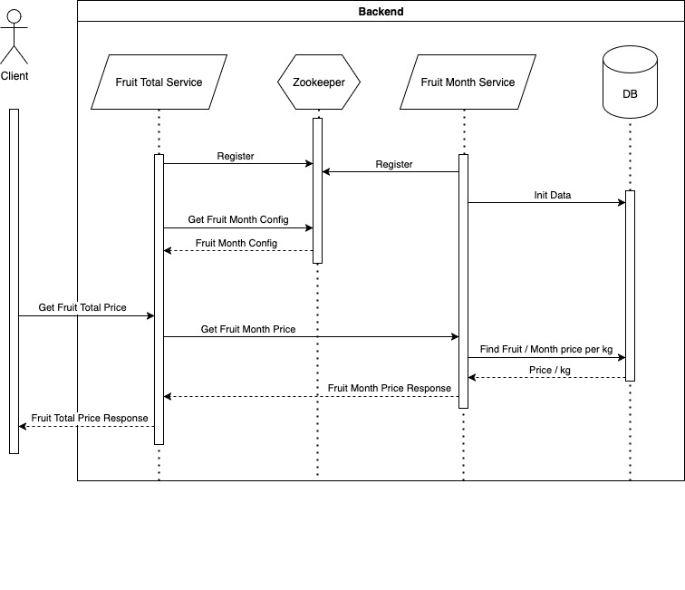

# Fruit price microservices

## Fruit price service

This service talks directly to the database to get the monthly price per kg of a fruit.

- Get all fruits:
  - `/fruit-price/fruits`
  - returns an array of fruit names. 

- Get monthly fruit price per kg: 
  - `/fruit-price/fruit/{fruit}/month/{3-letter month abbreviation}`
  - returns `{"id":1000,"fruit":"apricot","month":"jan","fmp":"8.51", "environment":"8000"}`.

## Fruit total service

This service calculates the total price of an order based on the monthly price fetched from the fruit price service and the quantity requested.

- Get price of fruit order:
  - `/fruit-total/fruit/{fruit}/month/{3-letter month abbreviation}/quantity/{number of kgs}`
  - returns `{"id":1000,"fruit":"apricot","month":"jan","fmp":8.51,"quantity":5,"total":"42.55","environment":"8100"}`

## Local Development

### Using maven and spring-boot.

#### Prerequisite

- Make sure you have a local Zookeeper instance running on port 2181.

#### Run fruit-month-price-service

1. `cd fruit-month-price-service`
2. `./mvnw spring-boot:run`
3. Access the service on localhost using port 8000

#### Run fruit-total-price-service

1. `cd fruit-total-price-service`
2. `./mvnw spring-boot:run`
3. Access the service on localhost using port 8100

### Using Docker Compose

1. `docker-compose up --build -d`
2. Access the services on localhost using ports 8000 and 8100

#### Zookeeper

To access service data in the zookeeper shell through Docker:

1. sh into the container
2. `zookeeper-shell localhost:2181`
3. `ls /services`
4. `get /services/fruit-total/{instance-id}`

### Frontend

Two ways to run the frontend:
- By simply opening the `./frontend/index.html` file directly in a browser.
- Through docker along with the rest of the containers `docker-compose up --build -d frontend`.
